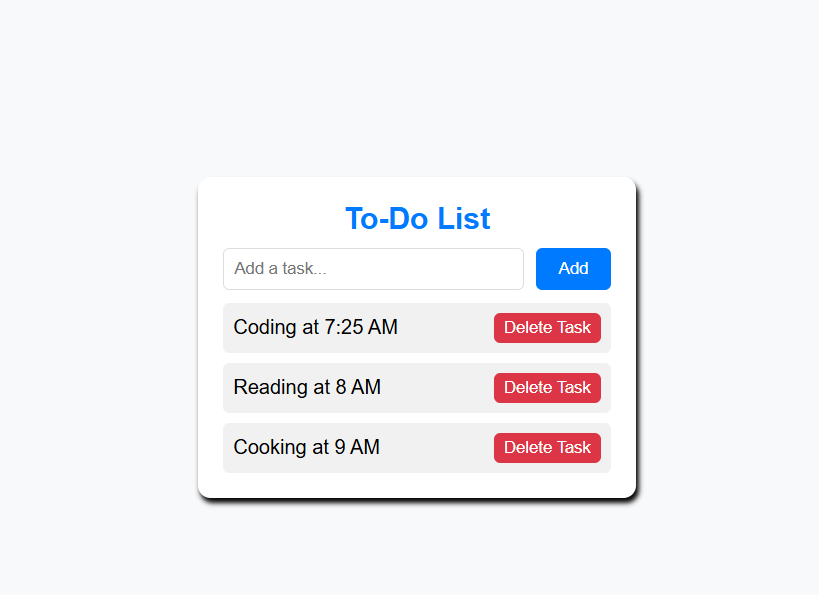

# To-Do App  

A simple and efficient **To-Do App** built with HTML, CSS, and JavaScript, using local storage to save your tasks even after refreshing the webpage or closing it.

## Screenshot

  

## Features  
- Add new tasks  
- Mark tasks as completed  
- Delete tasks  
- Save tasks in local storage  

## Technologies Used  
- **HTML** for structure  
- **CSS** for styling  
- **JavaScript** for functionality  

## Usage    
- Type a task in the input field and click Add.
- Click on a task to mark it as completed.
- Click the delete button to remove a task.

## Author
 👤 Saquib Furniturewala
- GitHub: [@SaquibFurniturewala1](https://github.com/SaquibFurniturewala1)
- Frontend Mentor:[ @SaquibFurniturewala1](https://www.frontendmentor.io/profile/SaquibFurniturewala1)
- LinkedIn: [Saquib Furniturewala](https://www.linkedin.com/in/saquib-furniturewala-a873411a1/)

## Live DOMO

To-Do App Live Link - https://saquibfurniturewala1.github.io/To-Do-App/

Contributing
Feel free to fork the repository and submit pull requests!